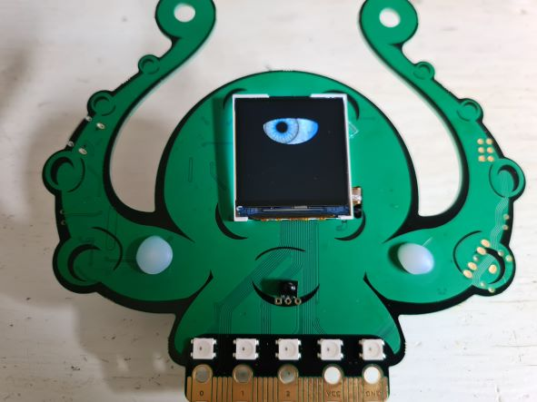

# This is the animated eye demo configured for the fri3d2022 Badge

It is an arduino project using the TFT_eSPI library (which contains the Animated_Eyes_1 demo)


## Getting started
Clone this repository
```
git clone https://github.com/cheops/fri3dCamp_Badge2020_Animated_Eye
```

### Additional board managers url
1. In the Arduino IDE, go to File > Preferences > Additional board managers URLs:
2. Add https://raw.githubusercontent.com/espressif/arduino-esp32/gh-pages/package_esp32_index.json
  Note: if you already have another boards URL, you can separate the URLs with a comma
3. Open the Boards Manager. Go to Tools > Board > Boards Manager…
4. Search for ESP32 and press install button for the "ESP32 by Espressif Systems"

### Install Arduino libraries:
1. In the Arduino IDE, go to Sketch > include library > Manage Libraries:
2. Search for TFT_eSPI and click on install
3. (optional) Search for SparkFun_LIS2DH12_Arduino_Library and click on install

### Configure TFT_eSPI
copy User_setup.h to TFT_eSPI in your Arduino libraries folder  
  you can find the Arduino libraries folder like this:
  In the Arduino IDE, go to File > Preferences > Sketchbook location:
  go to this folder/libraries/TFT_eSPI and overwrite User_setup.h with the file from this repository

more info can be found here
https://github.com/Bodmer/TFT_eSPI#Tips

### Select the correct board
1. Open the file Animated_Eyes_1/Animated_Eyes_1.ino from this repository in the arduino IDE
2. In the Arduino IDE, go to Tools > Board > ESP32 Wrover Module
3. In the Arduino IDE, go to Tools > Port > Select the port that the badge is connected on

### Compile and Upload
1. Press the Upload button, or go to Sketch > Upload


## Additional info
The display switch should be in the ON position (down)
If you want to enable the display backlight also when in the AUTO position then uncomment line 89
```
#define BACKLIGHT_CONNECTED_TO_LIS
```
This will configure the interrupt pin of the LIS accelerometer to be always on

## Manual blink the eye
Press the Boot button on the back to manually blink the eye